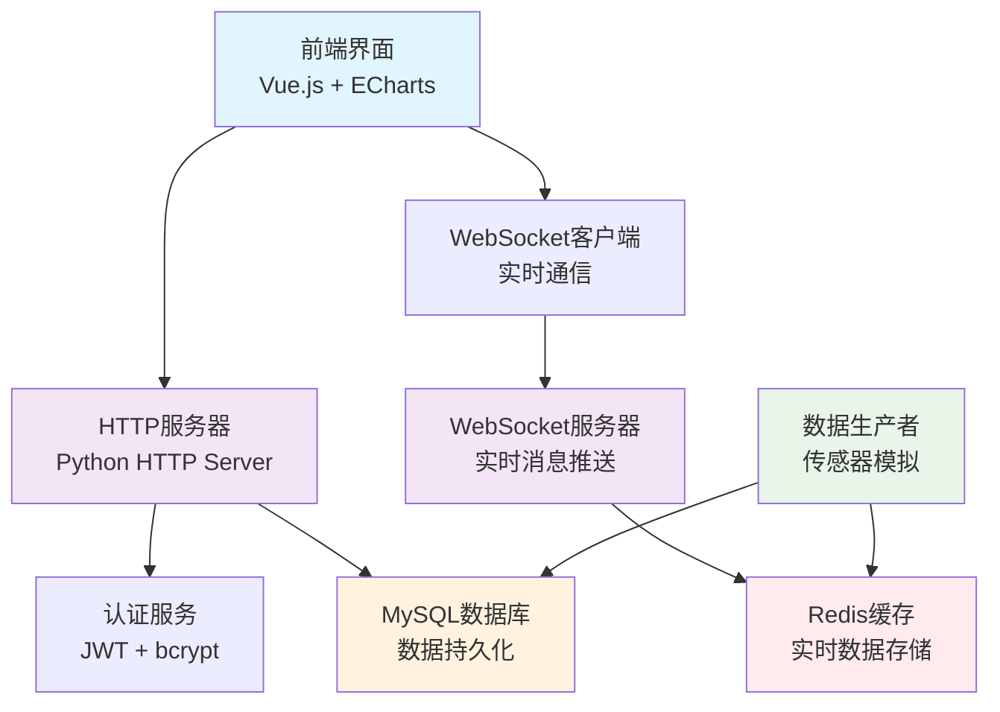

# 🌊 智能水利系统 IoT 监控平台

<div align="center">


**现代化的智能水利监控系统，集成实时数据采集、WebSocket通信、智能分析于一体**

[🚀 快速开始](#-快速部署) · [📖 文档](#-系统特性) · [🎯 演示](#-系统预览) · [🤝 贡献](#-贡献指南)

</div>

---

## 📋 目录

- [系统概述](#-系统概述)
- [系统特性](#-系统特性)
- [技术架构](#-技术架构)  
- [快速部署](#-快速部署)
- [系统预览](#-系统预览)
- [API文档](#-api文档)
- [开发指南](#-开发指南)
- [贡献指南](#-贡献指南)
- [许可证](#-许可证)

## 🌟 系统概述

智能水利系统是一个基于物联网技术的现代化水利监控平台，专为水库、水闸、泵站等水利设施的实时监控而设计。系统采用前后端分离架构，结合WebSocket实时通信，为水利管理提供全方位的数据支持和智能决策。

### 🎯 核心价值
- **实时监控**: 毫秒级数据更新，确保关键信息及时传达
- **智能分析**: AI驱动的数据分析，辅助决策制定
- **高可用性**: 分布式架构设计，支持7×24小时不间断运行
- **易于扩展**: 模块化设计，支持传感器和功能的快速扩展

## ✨ 系统特性

### 🔄 实时数据监控
- **12种传感器类型**: 水位、流量、水质、设备状态等全方位监控
- **毫秒级更新**: WebSocket实时推送，数据延迟 < 100ms
- **历史数据**: 完整的数据存储和历史趋势分析
- **异常告警**: 智能阈值监控，及时发现异常情况

### 🎨 现代化界面
- **响应式设计**: 完美适配PC、平板、手机等设备
- **实时图表**: ECharts驱动的动态数据可视化
- **直观操作**: 用户友好的操作界面，降低学习成本
- **深色主题**: 护眼的深色UI设计，适合长时间使用

### 🔐 安全可靠
- **JWT认证**: 基于Token的无状态身份验证
- **权限控制**: 多级用户权限管理
- **数据加密**: 敏感数据传输加密保护
- **操作日志**: 完整的用户操作审计追踪

### 🚀 高性能架构
- **Redis缓存**: 高速数据缓存，提升系统响应速度
- **MySQL存储**: 可靠的数据持久化存储
- **异步处理**: 基于asyncio的高并发处理能力
- **负载均衡**: 支持水平扩展和负载分布

## 🏗️ 技术架构



### 技术栈

**后端技术**
- **Python 3.9+**: 核心开发语言
- **WebSocket**: 实时双向通信
- **MySQL**: 关系型数据库
- **Redis**: 内存缓存数据库
- **JWT**: 无状态身份认证
- **bcrypt**: 密码加密

**前端技术**
- **Vue.js 3**: 渐进式JavaScript框架
- **ECharts**: 数据可视化图表库
- **WebSocket API**: 浏览器实时通信
- **CSS3**: 现代化UI样式
- **响应式设计**: 移动端适配

## 🚀 快速部署

### 自动部署 (推荐)

#### Windows 用户
```powershell
# 1. 克隆项目
git clone https://github.com/Guojin06/IoT_Water_Conservancy_Project.git
cd IoT_Water_Conservancy_Project

# 2. 运行一键部署脚本
.\deploy.ps1
```

#### Linux/macOS 用户
```bash
# 1. 克隆项目
git clone https://github.com/Guojin06/IoT_Water_Conservancy_Project.git
cd IoT_Water_Conservancy_Project

# 2. 运行一键部署脚本
chmod +x deploy.sh && ./deploy.sh
```

### 手动部署

<details>
<summary>点击展开手动部署步骤</summary>

#### 1. 环境要求
- Python 3.9+
- MySQL 8.0+
- Redis 6.0+

#### 2. 安装依赖
```bash
# 创建虚拟环境
python -m venv ai_env
source ai_env/bin/activate  # Linux/macOS
# ai_env\Scripts\activate     # Windows

# 安装依赖
pip install redis mysql-connector-python websockets aioredis bcrypt PyJWT
```

#### 3. 数据库初始化
```bash
mysql -u root -p < WaterConservancyIoT/create_database.sql
```

#### 4. 启动服务
```bash
cd WaterConservancyIoT
python start_production.py
```

</details>

### 访问系统

🌐 **Web界面**: http://localhost:8888  
👤 **默认账户**: admin / admin123

## 📱 系统预览

### 主控制台


*实时显示关键水利数据，包括水位、流量、设备状态等信息*

### 传感器管理


*统一管理所有传感器设备，实时监控运行状态*

### 数据分析


*智能数据分析，提供决策支持和趋势预测*

## 📚 API文档

### 认证接口
```http
POST /api/auth/login
Content-Type: application/json

{
  "username": "admin",
  "password": "admin123"
}
```

### 传感器数据
```http
GET /api/sensors/all
Authorization: Bearer <jwt_token>
```

### WebSocket连接
```javascript
const ws = new WebSocket('ws://localhost:8081');
ws.onmessage = (event) => {
  const data = JSON.parse(event.data);
  // 处理实时数据
};
```

详细API文档请参考: [API_DOCUMENTATION.md](WaterConservancyIoT/API_DOCUMENTATION.md)

## 🛠️ 开发指南

### 项目结构
```
IoT_Water_Conservancy_Project/
├── WaterConservancyIoT/          # 核心代码目录
│   ├── frontend/                 # 前端代码
│   │   ├── dashboard.html        # 主控制台
│   │   ├── system-management.html # 系统管理
│   │   └── js/                   # JavaScript模块
│   ├── data_producer.py          # 数据生产者
│   ├── working_websocket.py      # WebSocket服务器
│   ├── simple_server.py          # HTTP服务器
│   ├── mysql_client.py           # MySQL客户端
│   ├── redis_client.py           # Redis客户端
│   └── auth_service.py           # 认证服务
├── deploy.ps1                    # Windows部署脚本
├── deploy.sh                     # Linux/macOS部署脚本
└── README.md                     # 项目说明
```

### 开发环境设置
```bash
# 安装开发依赖
pip install -r requirements-dev.txt

# 启动开发服务器
python manage.py runserver

# 运行测试
python -m pytest tests/
```

### 新增传感器类型
1. 在 `data_producer.py` 中定义传感器配置
2. 更新数据库表结构 (如需要)
3. 修改前端显示逻辑
4. 添加对应的数据处理逻辑

## 🤝 贡献指南

我们欢迎任何形式的贡献！

### 贡献方式
1. **Fork** 本项目
2. 创建特性分支 (`git checkout -b feature/AmazingFeature`)
3. 提交更改 (`git commit -m 'Add some AmazingFeature'`)
4. 推送分支 (`git push origin feature/AmazingFeature`)
5. 提交 **Pull Request**

### 开发规范
- 遵循 PEP 8 Python代码规范
- 提交前请运行测试确保功能正常
- Pull Request 请包含详细的功能说明
- 新功能请添加相应的测试用例

## 📄 许可证

本项目采用 MIT 许可证。详情请参阅 [LICENSE](LICENSE) 文件。

---

<div align="center">

**⭐ 如果这个项目对你有帮助，请给它一个Star！ ⭐**

Made with ❤️ by [Guojin06](https://github.com/Guojin06)

</div>
