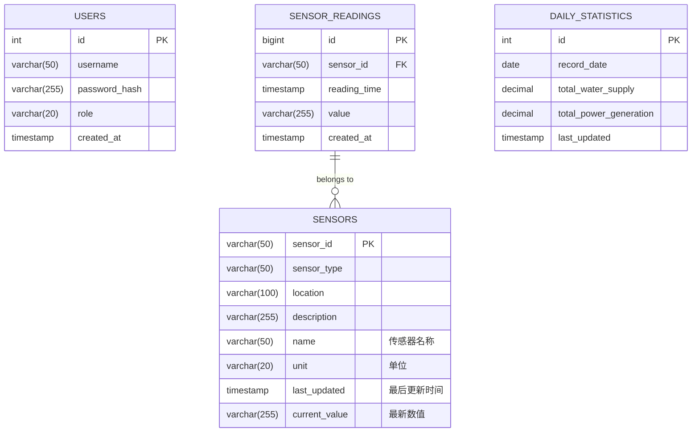

# 数据库设计文档

本文档详细描述了智能水库监测系统用于数据持久化的MySQL数据库设计。

## 1. 需求分析

我们需要持久化存储系统的核心数据，主要是来自各个传感器的历史读数。

- **核心数据**: 每个传感器在特定时间点产生的一条读数。
- **数据属性**: 一条读数应包含：时间戳、数值、单位、状态（正常/告警）。
- **数据来源**: 每条读数都必须关联到一个具体的传感器。
- **传感器信息**: 我们还需要一个地方存储每个传感器的元数据，比如它的ID、类型（水位/水质）、安装位置等，这样方便管理和查询。

## 2. 实体-关系 (E-R) 图

根据需求，我们可以识别出两个核心实体：`Sensors` (传感器) 和 `SensorReadings` (传感器读数)。

- 一个 `Sensor` 可以产生多条 `SensorReadings`。
- 一条 `SensorReading` 必须属于某一个 `Sensor`。

这是一个典型的一对多关系。

**Mermaid 语法的 E-R 图表示:**
```mermaid
erDiagram
    SENSORS {
        varchar(20) sensor_id PK "传感器ID (主键)"
        varchar(50) sensor_type "传感器类型"
        varchar(100) location "安装位置"
        text description "描述信息"
    }

    SENSOR_READINGS {
        bigint reading_id PK "读数ID (主键,自增)"
        varchar(20) sensor_id FK "传感器ID (外键)"
        timestamp timestamp "时间戳"
        decimal(10, 2) value "测量数值"
        varchar(20) unit "单位"
        varchar(20) status "状态"
    }

    SENSORS ||--|{ SENSOR_READINGS : "generates"
```

## 3. 创表SQL语句

根据上面的E-R图，我们可以编写如下的SQL语句来创建这两个表。

### 3.1 `sensors` 表
用于存储传感器的基本信息。

```sql
CREATE TABLE IF NOT EXISTS sensors (
    sensor_id VARCHAR(20) NOT NULL,
    sensor_type VARCHAR(50) NOT NULL,
    location VARCHAR(100),
    description TEXT,
    PRIMARY KEY (sensor_id)
) ENGINE=InnoDB DEFAULT CHARSET=utf8mb4;
```

### 3.2 `sensor_readings` 表
用于存储所有传感器的历史读数记录。

```sql
CREATE TABLE IF NOT EXISTS sensor_readings (
    reading_id BIGINT AUTO_INCREMENT,
    sensor_id VARCHAR(20) NOT NULL,
    `timestamp` TIMESTAMP NOT NULL DEFAULT CURRENT_TIMESTAMP,
    `value` DECIMAL(10, 2) NOT NULL,
    unit VARCHAR(20),
    status VARCHAR(20),
    PRIMARY KEY (reading_id),
    INDEX idx_sensor_timestamp (sensor_id, `timestamp`),
    FOREIGN KEY (sensor_id) REFERENCES sensors(sensor_id) ON DELETE CASCADE
) ENGINE=InnoDB DEFAULT CHARSET=utf8mb4;
```

#### **SQL语句说明**:
- `ENGINE=InnoDB` 使用InnoDB存储引擎，因为它支持外键和事务，保证数据一致性。
- `DEFAULT CHARSET=utf8mb4` 支持完整的UTF-8字符集，包括emoji等。
- `IF NOT EXISTS` 确保脚本可以重复运行而不会报错。
- `sensor_readings` 表中的 `sensor_id` 是一个外键，它关联到 `sensors` 表的主键。
- `ON DELETE CASCADE` 意味着如果一个传感器从 `sensors` 表中被删除了，它所有相关的历史读数也会自动被删除。
- `INDEX idx_sensor_timestamp` 为 `sensor_id` 和 `timestamp` 创建了一个复合索引，这将极大地提升按传感器和时间范围查询历史数据的速度。

## 4. 用户认证表 (`users`)

为了实现API的安全认证，我们需要一个表来存储用户信息。

### 4.1 `users` 表
用于存储可以登录系统的用户信息。

```sql
CREATE TABLE IF NOT EXISTS users (
    user_id INT AUTO_INCREMENT,
    username VARCHAR(50) NOT NULL UNIQUE,
    password_hash VARCHAR(255) NOT NULL,
    role VARCHAR(20) NOT NULL DEFAULT 'viewer',
    created_at TIMESTAMP NOT NULL DEFAULT CURRENT_TIMESTAMP,
    PRIMARY KEY (user_id)
) ENGINE=InnoDB DEFAULT CHARSET=utf8mb4;
```

#### **字段说明**:
- `username`: 用户名，必须是唯一的 (`UNIQUE`)。
- `password_hash`: 用于存储**加盐哈希**后的密码。**严禁存储明文密码**。长度设为255以兼容未来的哈希算法。
- `role`: 用户角色，例如 `admin` (管理员), `viewer` (观察员)。默认为 `viewer`，为将来的权限分级做准备。
- `created_at`: 记录用户创建时间。

## 5. 每日统计表 (`daily_statistics`)

为了支持发电量等统计数据的合理存储，我们需要一个表来存储每日的累计供水量和发电量等统计信息。

### 5.1 `daily_statistics` 表
用于存储每日的统计数据。

```sql
ALTER TABLE `users` ADD UNIQUE (`username`);

-- ----------------------------
-- Table structure for daily_statistics
-- ----------------------------
DROP TABLE IF EXISTS `daily_statistics`;
CREATE TABLE `daily_statistics` (
  `id` int NOT NULL AUTO_INCREMENT,
  `record_date` date NOT NULL,
  `total_water_supply` decimal(10,2) DEFAULT '0.00',
  `total_power_generation` decimal(10,2) DEFAULT '0.00',
  `peak_flow_rate` decimal(10,2) DEFAULT NULL,
  `average_water_level` decimal(10,2) DEFAULT NULL,
  `last_updated` timestamp NOT NULL DEFAULT CURRENT_TIMESTAMP ON UPDATE CURRENT_TIMESTAMP,
  PRIMARY KEY (`id`),
  UNIQUE KEY `record_date` (`record_date`)
) ENGINE=InnoDB DEFAULT CHARSET=utf8mb4 COLLATE=utf8mb4_0900_ai_ci COMMENT='每日统计数据表';
```

## 3. 表关系 E-R 图 (Mermaid 语法)


