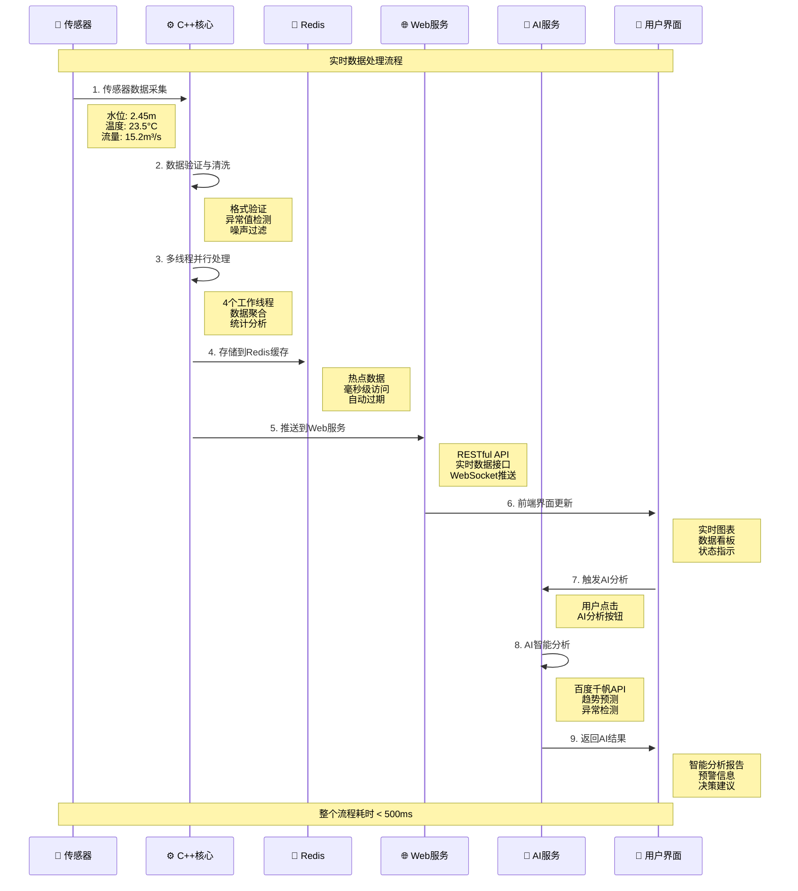

# 🏗️ IoT智能水利监控系统 - 总体架构设计

## 🌟 **系统概述**

本系统是一个**分布式、微服务化的智能水利监控平台**，采用**C++高性能核心 + Python AI服务 + Vue.js前端**的三层架构设计，实现水利设施的实时监控、智能分析和预警管理。

---

## 🏛️ **总体架构图**

```mermaid
graph TB
    %% 用户层
    subgraph Users ["👥 用户层 (User Layer)"]
        Operator["🧑‍💼 系统操作员<br/>日常监控操作"]
        Engineer["👨‍🔧 水利工程师<br/>专业分析决策"]
        Manager["👨‍💻 管理人员<br/>数据统计报告"]
        Visitor["👤 访客用户<br/>基础信息查看"]
    end

    %% 前端展示层
    subgraph Frontend ["🖥️ 前端展示层 (Frontend Layer)"]
        MainPage["🏠 主导航页面<br/>index.html<br/>系统入口导航"]
        Dashboard["📊 监控大屏<br/>dashboard.html<br/>专业水利监控界面"]
        TechCenter["🎛️ 智能监控中心<br/>tech-dashboard.html<br/>科技感操作界面"]
        AIInterface["🤖 AI分析界面<br/>ai-analysis.html<br/>智能分析功能"]
    end

    %% Web服务层
    subgraph WebService ["🌐 Web服务层 (Web Service Layer)"]
        PythonServer["🐍 Python HTTP服务器<br/>simple_server.py<br/>端口: 8888"]
        APIGateway["🚪 API网关<br/>路由分发<br/>负载均衡"]
        StaticFiles["📁 静态文件服务<br/>HTML/CSS/JS<br/>资源管理"]
    end

    %% AI智能分析层
    subgraph AILayer ["🧠 AI智能分析层 (AI Analysis Layer)"]
        AIService["🤖 AI分析服务<br/>Flask App<br/>端口: 5000"]
        AIProviders["🔌 AI服务提供商"]
        BaiduAPI["🔵 百度千帆<br/>1000次/日免费<br/>ERNIE-Bot-4.0"]
        AlibabaAPI["🟠 阿里通义<br/>500次/日免费<br/>qwen-turbo"]
        XunfeiAPI["🟣 讯飞星火<br/>200次/日免费<br/>spark-3.5"]
        LocalModel["💻 本地模型<br/>完全免费<br/>Ollama"]
        
        TrendAnalysis["📈 趋势分析<br/>水位预测<br/>流量预测"]
        AnomalyDetection["⚠️ 异常检测<br/>设备故障预警<br/>数据异常识别"]
        ReportGeneration["📄 报告生成<br/>智能分析报告<br/>决策建议"]
        IntelligentQA["💬 智能问答<br/>专业知识问答<br/>操作指导"]
    end

    %% C++核心处理层
    subgraph CoreLayer ["🔷 C++核心处理层 (Core Processing Layer)"]
        SensorLayer["📡 传感器层"]
        ProcessingLayer["⚙️ 数据处理层"]
        StorageLayer["💾 存储层"]
        ServiceLayer["🔌 服务层"]
        
        %% 传感器模块
        WaterSensors["🌊 水位传感器<br/>WL001, WL002<br/>实时水位监测"]
        TempSensors["🌡️ 温度传感器<br/>TEMP001, TEMP002<br/>环境温度监测"]
        FlowSensors["💧 流量传感器<br/>FLOW001<br/>水流量监测"]
        DeviceStatus["⚙️ 设备状态<br/>泵站/闸门<br/>设备运行状态"]
        
        %% 数据处理模块
        DataCollector["📥 数据采集器<br/>多线程采集<br/>实时数据收集"]
        MessageQueue["📨 消息队列<br/>异步处理<br/>解耦组件"]
        DataProcessor["⚙️ 数据处理引擎<br/>清洗/过滤/聚合<br/>4线程并行"]
        ThreadPool["🧵 线程池<br/>4个工作线程<br/>任务调度"]
        
        %% 存储模块
        RedisCache["⚡ Redis缓存<br/>热点数据<br/>毫秒级访问"]
        DataPersist["💾 数据持久化<br/>历史数据存储<br/>MySQL数据库"]
        BackupSystem["🔄 备份系统<br/>数据容灾<br/>自动备份"]
        
        %% 服务模块
        HTTPServer["🌐 HTTP服务器<br/>RESTful API<br/>端口: 8080"]
        APIEndpoints["🔗 API端点<br/>数据接口<br/>状态接口"]
        Authentication["🔒 身份认证<br/>安全控制<br/>访问权限"]
    end

    %% 基础设施层
    subgraph Infrastructure ["🏗️ 基础设施层 (Infrastructure Layer)"]
        Database["🗄️ 数据库<br/>Redis + MySQL<br/>缓存 + 持久化"]
        Network["🌐 网络服务<br/>HTTP/WebSocket<br/>实时通信"]
        Security["🔐 安全服务<br/>认证/授权<br/>数据加密"]
        Monitoring["📊 监控服务<br/>系统监控<br/>性能分析"]
    end

    %% 外部集成层
    subgraph External ["📦 外部集成层 (External Integration)"]
        WeatherAPI["🌤️ 气象数据API<br/>天气预报<br/>降雨预测"]
        GovAPI["🏛️ 政府数据API<br/>水文数据<br/>调度指令"]
        ThirdPartyAI["🤖 第三方AI服务<br/>云端AI<br/>专业算法"]
        CloudStorage["☁️ 云存储<br/>数据备份<br/>灾难恢复"]
    end

    %% 连接关系
    Users --> Frontend
    Frontend --> WebService
    WebService --> AILayer
    WebService --> CoreLayer
    
    AILayer --> AIProviders
    AIProviders --> BaiduAPI
    AIProviders --> AlibabaAPI
    AIProviders --> XunfeiAPI
    AIProviders --> LocalModel
    
    AIService --> TrendAnalysis
    AIService --> AnomalyDetection
    AIService --> ReportGeneration
    AIService --> IntelligentQA
    
    CoreLayer --> SensorLayer
    CoreLayer --> ProcessingLayer
    CoreLayer --> StorageLayer
    CoreLayer --> ServiceLayer
    
    SensorLayer --> WaterSensors
    SensorLayer --> TempSensors
    SensorLayer --> FlowSensors
    SensorLayer --> DeviceStatus
    
    ProcessingLayer --> DataCollector
    ProcessingLayer --> MessageQueue
    ProcessingLayer --> DataProcessor
    ProcessingLayer --> ThreadPool
    
    StorageLayer --> RedisCache
    StorageLayer --> DataPersist
    StorageLayer --> BackupSystem
    
    ServiceLayer --> HTTPServer
    ServiceLayer --> APIEndpoints
    ServiceLayer --> Authentication
    
    CoreLayer --> Infrastructure
    Infrastructure --> Database
    Infrastructure --> Network
    Infrastructure --> Security
    Infrastructure --> Monitoring
    
    AILayer -.-> External
    CoreLayer -.-> External
    External --> WeatherAPI
    External --> GovAPI
    External --> ThirdPartyAI
    External --> CloudStorage

    %% 样式定义
    classDef userLayer fill:#e3f2fd,stroke:#1565c0,stroke-width:3px
    classDef frontendLayer fill:#e8f5e8,stroke:#2e7d32,stroke-width:3px
    classDef webLayer fill:#fff3e0,stroke:#ef6c00,stroke-width:3px
    classDef aiLayer fill:#fce4ec,stroke:#880e4f,stroke-width:3px
    classDef coreLayer fill:#e1f5fe,stroke:#01579b,stroke-width:3px
    classDef infraLayer fill:#f3e5f5,stroke:#7b1fa2,stroke-width:3px
    classDef externalLayer fill:#f1f8e9,stroke:#33691e,stroke-width:3px

    class Users userLayer
    class Frontend frontendLayer
    class WebService webLayer
    class AILayer aiLayer
    class CoreLayer coreLayer
    class Infrastructure infraLayer
    class External externalLayer
```



---

## 🔄 **系统数据流程图**



---

## 🏗️ **技术架构特点**

### 🚀 **高性能架构**
- **C++17核心引擎**: 高性能数据处理，支持大量并发
- **多线程并行**: 4个工作线程，充分利用多核CPU
- **Redis缓存**: 毫秒级数据访问，热点数据缓存
- **异步消息队列**: 解耦组件，提升系统吞吐量

### 🧠 **智能化特性**
- **多AI提供商**: 百度千帆、阿里通义、讯飞星火
- **免费AI额度**: 每日2000+次免费调用
- **专业水利分析**: 趋势预测、异常检测、智能报告
- **自然语言交互**: 智能问答，专业知识库

### 🔒 **安全可靠性**
- **模块化设计**: 高内聚低耦合，故障隔离
- **多层数据验证**: 传感器→处理→存储全链路验证
- **容灾备份**: 数据持久化，自动备份恢复
- **访问控制**: API认证，权限管理

### 🌐 **可扩展性**
- **微服务架构**: 独立部署，弹性扩容
- **标准化接口**: RESTful API，易于集成
- **插件化设计**: 新传感器、AI服务易于接入
- **云原生支持**: Docker容器化，Kubernetes编排

---

## 📊 **系统性能指标**

### ⚡ **性能指标**
- **数据处理能力**: 1000+ 条/秒
- **API响应时间**: < 100ms (95%ile)
- **AI分析延迟**: < 2s (包含网络请求)
- **系统可用性**: > 99.9%
- **并发用户数**: 100+ 用户同时在线

### 💾 **存储指标**
- **Redis缓存**: 1GB内存，10000+ keys
- **历史数据**: MySQL存储，支持TB级数据
- **数据保留**: 实时数据7天，历史数据5年
- **备份策略**: 每日增量，每周全量

### 🔋 **资源消耗**
- **CPU使用率**: 平均 < 30%
- **内存使用**: < 2GB
- **磁盘I/O**: < 50MB/s
- **网络带宽**: < 10Mbps

---

## 🚀 **部署架构**

### 🐳 **容器化部署**
```yaml
version: '3.8'
services:
  # C++核心服务
  core-service:
    image: water-iot-core:latest
    ports: ["8080:8080"]
    
  # Python AI服务
  ai-service:
    image: water-iot-ai:latest
    ports: ["5000:5000"]
    
  # Web前端服务
  web-service:
    image: water-iot-web:latest
    ports: ["8888:8888"]
    
  # Redis缓存
  redis:
    image: redis:7-alpine
    ports: ["6379:6379"]
    
  # MySQL数据库
  mysql:
    image: mysql:8.0
    ports: ["3306:3306"]
```

### ☁️ **云服务器部署**
- **推荐配置**: 4核8G，SSD硬盘
- **支持平台**: 阿里云ECS、腾讯云CVM、AWS EC2、Azure VM
- **操作系统**: Ubuntu 20.04+ / CentOS 8+
- **域名配置**: 支持HTTPS，CDN加速

---

## 📈 **扩展规划**

### 🔮 **短期规划 (1-3个月)**
- ✅ 完善Redis/MySQL真实连接
- ✅ Docker容器化部署
- ✅ 完整测试覆盖
- ✅ 性能优化调优

### 🚀 **中期规划 (3-6个月)**
- 🔄 Kubernetes集群部署
- 🔄 微服务架构优化
- 🔄 更多AI算法集成
- 🔄 移动端APP开发

### 🌟 **长期规划 (6-12个月)**
- 🔄 大数据分析平台
- 🔄 机器学习模型训练
- 🔄 边缘计算支持
- 🔄 行业解决方案

---

*最后更新: 2025-09-13*
*系统版本: v1.0.0*
*架构设计: 分布式微服务架构*
