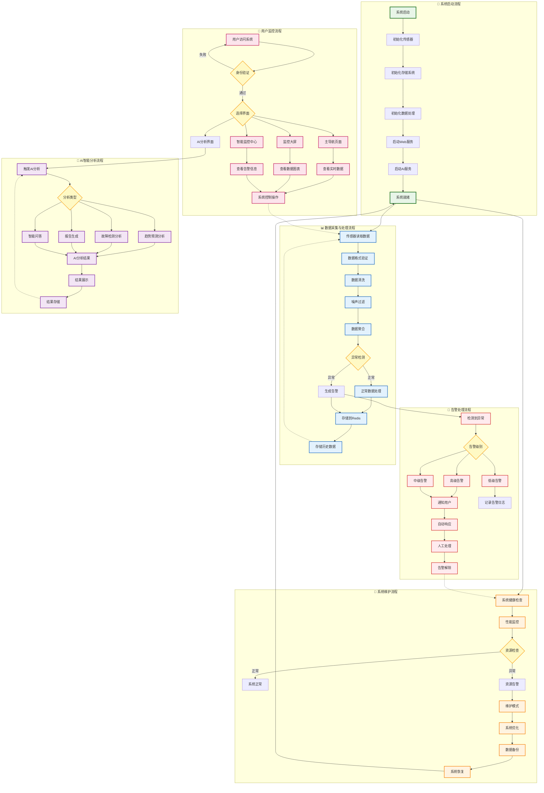
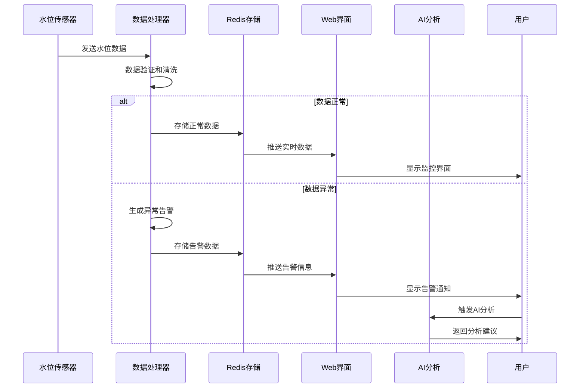
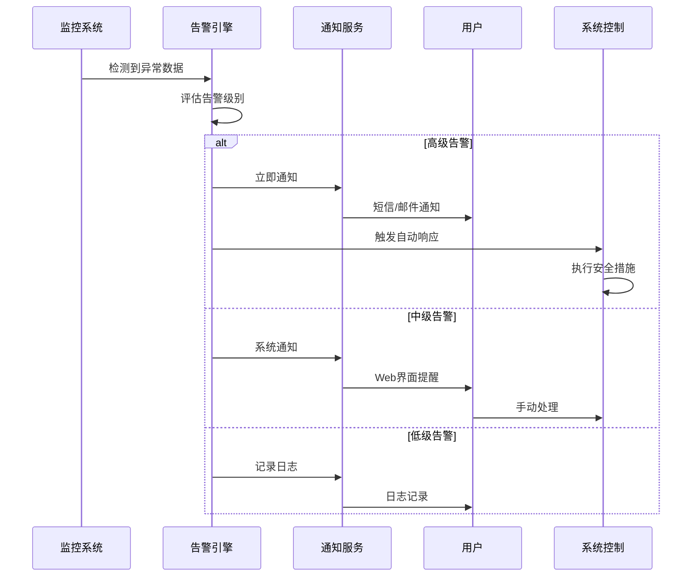
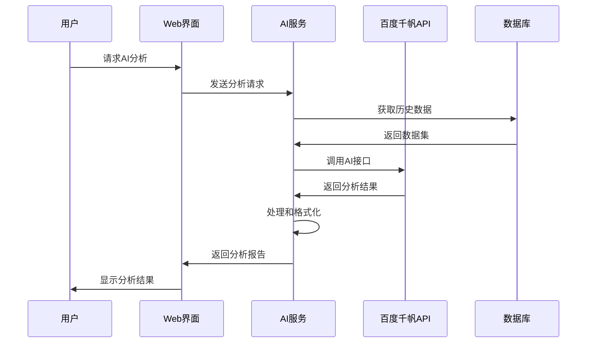

# 智能水利物联网系统 - 业务流程图

## 业务流程图

## 核心业务场景

### 1. 🌊 水位监测业务流程

### 2. 🚨 异常告警业务流程

### 3. 🤖 AI分析业务流程

## 业务特点

### 📊 数据驱动
- **实时采集**: 多传感器5秒-10秒采集周期
- **实时处理**: 毫秒级数据处理响应
- **实时展示**: 自动刷新监控界面

### 🎯 智能决策
- **异常检测**: 自动识别数据异常
- **趋势预测**: AI预测水位变化趋势
- **智能建议**: 提供运维决策建议

### 🔄 闭环管理
- **监测→分析→决策→执行→反馈**
- **自动化程度高，人工干预少**
- **持续优化和学习**

### 🛡️ 安全保障
- **多级告警机制**
- **自动故障处理**
- **数据备份和恢复**
