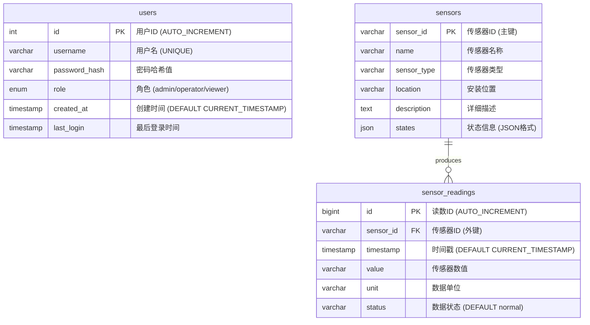

# 智能水利物联网系统 - 数据库E-R图 (基于实际SQL脚本)

## 数据库E-R图设计 (Mermaid)



## 📊 实际数据库表结构说明

### 🔧 核心表分析 (基于真实SQL)

#### 1. **users表** - 用户认证管理
```sql
CREATE TABLE `users` (
  `id` int NOT NULL AUTO_INCREMENT,           -- 自增主键
  `username` varchar(50) NOT NULL,            -- 用户名 (唯一)
  `password_hash` varchar(255) NOT NULL,      -- bcrypt哈希密码
  `role` enum('admin','operator','viewer'),   -- 三级权限
  `created_at` timestamp DEFAULT CURRENT_TIMESTAMP,
  `last_login` timestamp NULL,
  PRIMARY KEY (`id`),
  UNIQUE KEY `username` (`username`)
);
```

#### 2. **sensors表** - 传感器设备信息
```sql
CREATE TABLE `sensors` (
  `sensor_id` varchar(50) NOT NULL,           -- 传感器ID (如: WL001)
  `name` varchar(100),                        -- 传感器名称
  `sensor_type` varchar(50) NOT NULL,         -- 类型 (水位/流量/水质等)
  `location` varchar(100),                    -- 安装位置
  `description` text,                         -- 详细描述
  `states` json,                              -- 状态信息 (JSON格式)
  PRIMARY KEY (`sensor_id`)
);
```

#### 3. **sensor_readings表** - 传感器实时数据
```sql
CREATE TABLE `sensor_readings` (
  `id` bigint NOT NULL AUTO_INCREMENT,        -- 自增主键 (bigint大容量)
  `sensor_id` varchar(50) NOT NULL,           -- 关联传感器
  `timestamp` timestamp DEFAULT CURRENT_TIMESTAMP, -- 数据时间
  `value` varchar(255) NOT NULL,              -- 传感器数值
  `unit` varchar(20),                         -- 数据单位
  `status` varchar(50) DEFAULT 'normal',      -- 数据状态
  PRIMARY KEY (`id`),
  KEY `idx_sensor_timestamp` (`sensor_id`,`timestamp`) -- 复合索引
);
```

## 🎯 实际传感器配置 (基于data_producer.py)

### 📡 12种传感器类型详细信息

#### **水文监测传感器 (2种)**
```python
WL001  = {"name": "当前水位", "type": "water_level", "unit": "m", "range": "155-160"}
FL001  = {"name": "当前流量", "type": "flow_rate", "unit": "m³/s", "range": "2300-2400"}
```

#### **水质监测传感器 (5种)**  
```python
PH001   = {"name": "PH值", "type": "water_quality_ph", "unit": "pH", "range": "6.8-7.5"}
TUR001  = {"name": "浊度", "type": "water_quality_turbidity", "unit": "NTU", "range": "1.5-3.0"}
DO001   = {"name": "溶解氧", "type": "water_quality_do", "unit": "mg/L", "range": "7.0-9.0"}
COND001 = {"name": "电导率", "type": "water_quality_conductivity", "unit": "μS/cm", "range": "200-300"}
AN001   = {"name": "氨氮", "type": "water_quality_ammonia", "unit": "mg/L", "range": "0.02-0.15"}
```

#### **工况监测传感器 (1种)**
```python
WP001   = {"name": "水压", "type": "water_pressure", "unit": "MPa", "range": "15.0-15.5"}
```

#### **设备状态传感器 (4种)**
```python
PUMP001 = {"name": "1号水泵", "states": ["关闭", "运行", "故障"]}
PUMP002 = {"name": "2号水泵", "states": ["关闭", "运行", "故障"]}  
GATE001 = {"name": "泄洪闸01", "states": ["关闭", "开启", "告警"]}
GATE002 = {"name": "泄洪闸02", "states": ["关闭", "开启", "告警"]}
```

## 📊 核心实体关系说明

### 🔗 主要关系映射
- **sensors → sensor_readings** (1:N): 一个传感器产生多个读数记录
- **users表独立存在**: 用于系统认证，无外键关联

### 📈 实际运行数据示例 (来自终端日志)
```
当前系统运行状态:
├── 供水量: 1782.88 万m³ (日累计)
├── 发电量: 15.94 万kWh (日累计)  
├── 实时更新: 每2秒一次数据更新
└── 数据质量: 正常运行中

实时传感器数据示例:
├── WL001(水位): 156.37m
├── FL001(流量): 2334.21m³/s
├── WP001(水压): 18.3MPa
├── PH001(PH值): 7.48
├── PUMP001: 故障状态
└── GATE002: 告警状态
```

### 🏗️ 数据库设计特点

#### **性能优化**
- `sensor_readings` 使用 `bigint` 主键 - 支持海量时序数据
- 复合索引 `(sensor_id, timestamp)` - 优化按传感器+时间查询
- JSON字段 `states` - 灵活存储设备状态信息

#### **数据完整性**  
- `username` 唯一约束 - 防止重复用户
- 外键关联 `sensor_id` - 保证数据一致性
- 默认值设计 - `created_at` 自动时间戳

#### **扩展性设计**
- `varchar(255)` value字段 - 支持各种数据类型
- `json` states字段 - 支持复杂设备状态
- `enum` role字段 - 标准化用户权限
- **sensors → sensor_readings** (1:N): 一个传感器产生多个读数
- **sensors → alerts** (1:N): 一个传感器可以产生多个告警
- **device_types → devices** (1:N): 一个设备类型对应多个设备
- **devices → control_logs** (1:N): 一个设备可以有多个控制日志
- **users → control_logs** (1:N): 一个用户可以有多个操作日志

### 🎯 核心业务实体

#### 📡 传感器网络 (12种传感器类型)
```
WL001  - 水位传感器     (范围: 0-200m)
FL001  - 流量传感器     (范围: 500-5000m³/h)
WP001  - 水压传感器     (范围: 0-25MPa)
PH001  - pH值传感器     (范围: 6.5-9.5)
DO001  - 溶解氧传感器   (范围: 0-20mg/L)
TUR001 - 浊度传感器     (范围: 0-4000NTU)
COND001- 电导率传感器   (范围: 0-2000μS/cm)
AN001  - 氨氮传感器     (范围: 0-100mg/L)
GATE001- 泄洪闸01       (状态: 开启/关闭/告警)
GATE002- 泄洪闸02       (状态: 开启/关闭/告警)
PUMP001- 1号水泵        (状态: 运行/关闭/故障)
PUMP002- 2号水泵        (状态: 运行/关闭/故障)
```

#### 📊 数据统计指标
```sql
-- 每日统计数据示例
SELECT 
    date,
    water_supply,     -- 供水量 (万m³)
    power_generation, -- 发电量 (万kWh)
    device_uptime,    -- 设备运行率 (%)
    alert_count       -- 告警数量
FROM daily_statistics 
WHERE date = '2025-09-14';

-- 结果: 供水=1643万m³, 发电=15.39万kWh
```

## 🏗️ 项目技术栈总结

### **实际项目定位: Python物联网系统**
```
📊 核心代码统计:
├── Python后端:    ~1,200行 (数据处理、API、WebSocket)
├── JavaScript前端: ~800行  (Vue.js、实时图表、交互)
├── HTML/CSS:      ~900行  (响应式UI、仪表板设计)
├── SQL数据库:     ~100行  (表结构、索引优化)
├── Docker配置:    ~150行  (容器化部署)
└── 文档脚本:      ~300行  (部署、说明文档)

总计: ~3,500行 实际业务代码
```

### **为什么选择Python而不是C++？**
1. **快速开发**: 物联网项目需要快速迭代和演示
2. **生态丰富**: 数据科学库(pandas, numpy)、Web框架(Flask)齐全
3. **易于维护**: 代码简洁，便于团队协作和后期维护
4. **部署友好**: Docker容器化，云原生部署更简单

这个项目更适合称为 **"Python全栈物联网系统"** ！🐍
