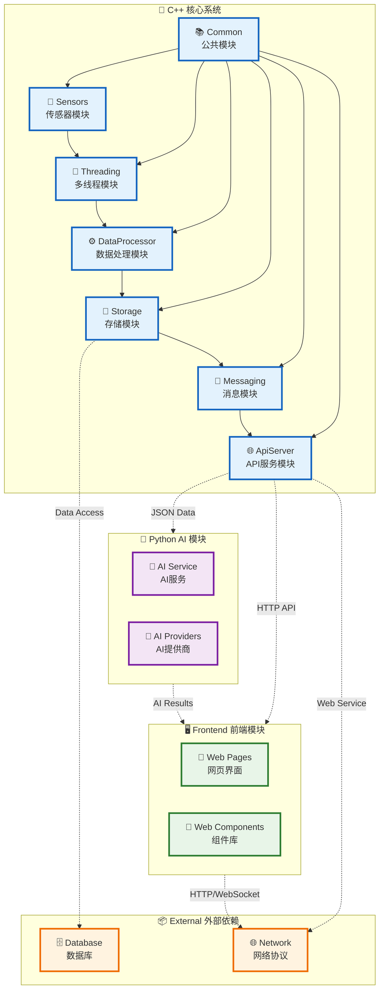

# 智能水利物联网系统 - 模块架构图

## 系统模块关系图



## 模块详细说明

### 🔷 C++ 核心系统模块

#### 📚 Common 公共模块
- **Logger**: 统一日志管理，支持多级别日志输出
- **Config**: 配置文件管理，支持JSON配置加载
- **Utils**: 通用工具函数，时间处理、字符串操作等

#### 📡 Sensors 传感器模块
- **SensorBase**: 传感器抽象基类，定义通用接口
- **WaterLevelSensor**: 水位传感器，模拟水库水位数据
- **TemperatureSensor**: 温度传感器，监测环境温度
- **FlowSensor**: 流量传感器，监测水流量数据

#### ⚙️ DataProcessor 数据处理模块
- **WaterDataProcessor**: 主数据处理引擎
- **DataCleaner**: 数据清洗，去除无效数据
- **DataFilter**: 数据过滤，噪声处理和异常值检测
- **DataAggregator**: 数据聚合，统计分析和汇总

#### 💾 Storage 存储模块
- **RedisStorage**: Redis数据存储接口
- **CacheManager**: 缓存管理，热点数据快速访问
- **DataPersistence**: 数据持久化，历史数据存储

#### 🧵 Threading 多线程模块
- **ThreadPool**: 线程池管理，支持并发任务处理
- **SensorProcessor**: 传感器数据处理器，多线程数据处理
- **SensorSimulator**: 传感器模拟器，多传感器数据生成

#### 📨 Messaging 消息模块
- **MessageQueue**: 消息队列实现，异步消息传递
- **TopicManager**: 主题管理，消息分类和路由
- **EventBus**: 事件总线，组件间通信

#### 🌐 ApiServer API服务模块
- **HttpServer**: HTTP服务器，Web API接口
- **ApiGateway**: API网关，请求路由和认证
- **RequestHandler**: 请求处理器，业务逻辑处理

### 🐍 Python AI 模块

#### 🤖 AI Service
- **Flask App**: Web服务框架，提供AI分析接口
- **AI Client**: AI客户端，统一AI服务调用接口
- **WaterAIAnalyzer**: 水利AI分析器，专业水利分析算法

#### 🔌 AI Providers
- **Baidu Qianfan**: 百度千帆API，1000次/日免费
- **Alibaba Tongyi**: 阿里通义API，500次/日免费
- **OpenAI API**: OpenAI接口，付费服务
- **Local Model**: 本地模型，完全免费方案

### 🖥️ Frontend 前端模块

#### 界面组件
- **Main Page**: 主导航页面，系统入口
- **Dashboard**: 监控大屏，专业水利监控界面
- **Tech Center**: 智能监控中心，科技感操作界面
- **AI Interface**: AI分析界面，智能分析功能

#### 🎨 Web Components
- **Charts**: 图表组件，数据可视化
- **Real-time Data**: 实时数据组件，动态数据展示
- **Alert Panel**: 告警面板，异常信息展示
- **Control Panel**: 控制面板，系统操作控制

## 模块间通信机制

### 🔄 内部通信
- **同步调用**: 直接函数调用，适用于快速响应场景
- **异步消息**: 消息队列，适用于解耦和并发场景
- **事件驱动**: 事件总线，适用于广播通知场景

### 🌐 跨语言通信
- **HTTP API**: C++系统对外提供RESTful接口
- **JSON数据**: 标准化数据交换格式
- **WebSocket**: 实时双向通信

### 📊 数据流向
```
传感器数据 → 数据处理 → 存储缓存 → API接口 → 前端展示
              ↓
            消息队列 → AI分析 → 智能结果 → 用户界面
```

## 架构优势

### 🏗️ 模块化设计
- **高内聚低耦合**: 每个模块职责明确，依赖关系清晰
- **可扩展性**: 新功能可以独立模块形式添加
- **可维护性**: 模块间接口稳定，便于维护升级

### ⚡ 高性能架构
- **多线程并发**: 充分利用多核CPU资源
- **缓存优化**: Redis缓存提升数据访问速度
- **异步处理**: 消息队列避免阻塞，提升吞吐量

### 🔒 安全可靠
- **模块隔离**: 故障隔离，避免单点故障影响全系统
- **数据一致性**: 多层数据校验，确保数据准确性
- **容错机制**: 异常处理和自动恢复机制
