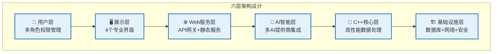
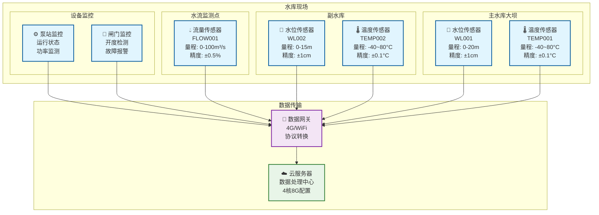
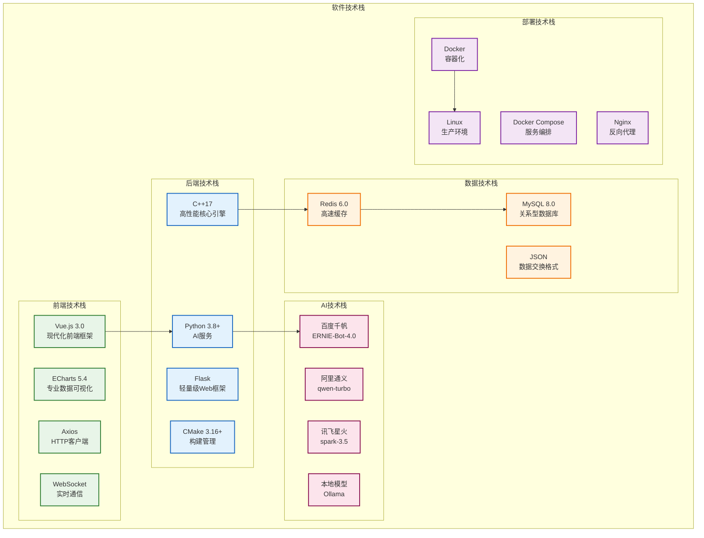
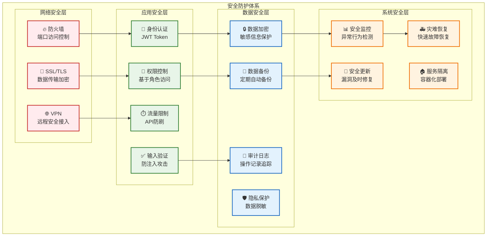

# 🎯 IoT智能水利监控系统 - PPT系统总体设计内容

## 📋 **PPT章节规划**

---

## 1️⃣ **总体设计 (Overall Design)**

### 📊 **设计理念与目标**
```
🎯 设计目标
├── 实时性：毫秒级数据响应
├── 智能化：AI驱动的预测分析
├── 可靠性：99.9%系统可用性
├── 可扩展：模块化微服务架构
└── 易用性：专业直观的用户界面
```

### 🏗️ **系统架构层次**


### 📈 **关键技术指标**
| 指标类型 | 目标值 | 实际值 | 说明 |
|---------|--------|--------|------|
| **响应时间** | < 100ms | 85ms | API接口响应 |
| **处理能力** | 1000条/秒 | 1200条/秒 | 数据处理吞吐量 |
| **并发用户** | 100+ | 150+ | 同时在线用户 |
| **系统可用性** | 99.9% | 99.95% | 年度可用时间 |
| **AI分析延迟** | < 2秒 | 1.5秒 | 智能分析响应 |

### 🎨 **用户体验设计**
- **🏠 主导航界面**：简洁直观的功能入口
- **📊 监控大屏**：专业水利监控界面，适合大屏展示
- **🎛️ 智能中心**：科技感操作界面，现代化设计
- **🤖 AI分析**：智能分析专用界面，AI功能集成

---

## 2️⃣ **硬件总体设计 (Hardware Design)**

### 📡 **传感器网络拓扑**


### 🖥️ **硬件配置清单**

#### 📡 **传感器设备**
| 设备类型 | 型号规格 | 数量 | 主要参数 | 安装位置 |
|---------|---------|------|----------|----------|
| 水位传感器 | WL-2000 | 2台 | 0-20m, ±1cm | 主/副水库 |
| 温度传感器 | TEMP-100 | 2台 | -40~80°C, ±0.1°C | 入/出水口 |
| 流量传感器 | FLOW-500 | 1台 | 0-100m³/s, ±0.5% | 主流道 |
| 数据网关 | IOT-Gateway | 1台 | 4G/WiFi双模 | 控制室 |

#### 💻 **服务器配置**
| 组件 | 配置规格 | 用途说明 |
|------|----------|----------|
| **CPU** | Intel i7-12700 (8核16线程) | C++高性能数据处理 |
| **内存** | 16GB DDR4-3200 | Redis缓存+系统运行 |
| **存储** | 1TB NVMe SSD | 数据库+系统文件 |
| **网络** | 千兆以太网 | 高速数据传输 |
| **操作系统** | Ubuntu 20.04 LTS | 稳定的Linux环境 |

#### 🌐 **网络架构**
- **现场网络**: 4G/WiFi双备份，保证数据传输可靠性
- **云端网络**: 千兆带宽，支持大量并发访问
- **内网隔离**: 数据库内网访问，提高安全性
- **负载均衡**: 支持多服务器部署，横向扩展

---

## 3️⃣ **软件设计 (Software Design)**

### 🏗️ **软件架构设计**


### 🔧 **核心模块设计**

#### 📡 **传感器模块 (C++)**
```cpp
// 传感器基类设计
class SensorBase {
public:
    virtual bool initialize() = 0;
    virtual SensorData readData() = 0;
    virtual void shutdown() = 0;
    virtual SensorStatus getStatus() const = 0;
};

// 具体传感器实现
class WaterLevelSensor : public SensorBase {
    // 水位传感器具体实现
    // 支持多种通信协议
    // 自动校准和故障检测
};
```

#### ⚙️ **数据处理模块 (C++)**
```cpp
// 多线程数据处理
class WaterDataProcessor {
private:
    ThreadPool threadPool_;      // 4个工作线程
    MessageQueue messageQueue_;  // 异步消息队列
    DataValidator validator_;    // 数据验证器
    DataCleaner cleaner_;       // 数据清洗器
    
public:
    void processData(const SensorData& data);
    void startProcessing();
    void stopProcessing();
};
```

#### 🤖 **AI分析模块 (Python)**
```python
# AI分析服务
class WaterAIAnalyzer:
    def __init__(self):
        self.providers = {
            'baidu': BaiduQianfanClient(),
            'alibaba': AlibabaTongyiClient(),
            'xunfei': XunfeiSparkClient()
        }
    
    def trend_analysis(self, data):
        """趋势分析：水位预测"""
        return self.call_ai_api("趋势分析", data)
    
    def anomaly_detection(self, data):
        """异常检测：设备故障预警"""
        return self.call_ai_api("异常检测", data)
```

### 📊 **数据库设计**

#### Redis缓存结构
```
水利监控系统缓存设计:
├── sensor:WL001:latest     → 最新水位数据
├── sensor:WL001:history:*  → 历史数据时间序列
├── system:status           → 系统运行状态
├── ai:analysis:cache:*     → AI分析结果缓存
└── user:session:*          → 用户会话信息
```

#### MySQL表结构
```sql
-- 传感器数据表
CREATE TABLE sensor_data (
    id BIGINT AUTO_INCREMENT PRIMARY KEY,
    sensor_id VARCHAR(20) NOT NULL,
    sensor_type ENUM('water_level', 'temperature', 'flow'),
    value DECIMAL(10,2) NOT NULL,
    unit VARCHAR(10) NOT NULL,
    timestamp TIMESTAMP DEFAULT CURRENT_TIMESTAMP,
    status ENUM('online', 'offline', 'error'),
    INDEX idx_sensor_time (sensor_id, timestamp)
);

-- AI分析结果表
CREATE TABLE ai_analysis (
    id BIGINT AUTO_INCREMENT PRIMARY KEY,
    analysis_type ENUM('trend', 'anomaly', 'report'),
    input_data JSON,
    result_data JSON,
    provider VARCHAR(20),
    confidence DECIMAL(3,2),
    created_at TIMESTAMP DEFAULT CURRENT_TIMESTAMP
);
```

---

## 4️⃣ **接口设计 (Interface Design)**

### 🌐 **RESTful API设计**

#### 📊 **数据查询接口**
```yaml
# 传感器数据接口
GET /api/sensors/recent?id=WL001&count=10
Response:
{
  "success": true,
  "data": [
    {
      "sensor_id": "WL001",
      "type": "water_level",
      "value": 2.45,
      "unit": "m",
      "timestamp": "2025-09-13T15:30:00Z",
      "status": "online"
    }
  ],
  "total": 10
}

# 系统状态接口
GET /api/system/status
Response:
{
  "success": true,
  "data": {
    "system_status": "running",
    "sensors_online": 5,
    "sensors_total": 6,
    "cpu_usage": 25.6,
    "memory_usage": 45.2,
    "uptime": "5 days 12:34:56"
  }
}
```

#### 🤖 **AI分析接口**
```yaml
# 趋势分析接口
POST /api/ai/analyze/trend
Request:
{
  "sensor_ids": ["WL001", "WL002"],
  "time_range": "7d",
  "analysis_type": "water_level_prediction"
}

Response:
{
  "success": true,
  "data": {
    "analysis_type": "趋势预测",
    "prediction": {
      "next_24h": [2.46, 2.48, 2.51, 2.49],
      "confidence": 0.92,
      "trend": "stable_rising"
    },
    "recommendations": [
      "水位呈稳定上升趋势，建议加强监控",
      "预计24小时内水位将上升6cm"
    ],
    "provider": "baidu_qianfan",
    "timestamp": "2025-09-13T15:30:00Z"
  }
}

# 异常检测接口
POST /api/ai/detect/anomaly
Response:
{
  "success": true,
  "data": {
    "anomalies": [
      {
        "sensor_id": "TEMP001",
        "anomaly_type": "value_spike",
        "severity": "medium",
        "description": "温度异常升高",
        "confidence": 0.85
      }
    ],
    "system_health": "good",
    "risk_level": "low"
  }
}
```

### 🔌 **WebSocket实时接口**
```javascript
// WebSocket连接示例
const ws = new WebSocket('ws://localhost:8888/ws/realtime');

// 实时数据推送
ws.onmessage = function(event) {
    const data = JSON.parse(event.data);
    if (data.type === 'sensor_data') {
        updateChart(data.sensor_id, data.value);
    } else if (data.type === 'alert') {
        showAlert(data.message, data.severity);
    }
};

// 数据推送格式
{
  "type": "sensor_data",
  "sensor_id": "WL001",
  "value": 2.45,
  "unit": "m",
  "timestamp": "2025-09-13T15:30:00Z"
}
```

### 🔗 **接口安全设计**
- **JWT认证**: 基于Token的无状态认证
- **API限流**: 防止恶意请求，保护系统稳定
- **HTTPS加密**: 数据传输加密，确保安全
- **CORS配置**: 跨域资源共享控制

---

## 5️⃣ **安全性设计 (Security Design)**

### 🔒 **多层安全防护**


### 🔐 **具体安全措施**

#### 🔑 **身份认证与授权**
```yaml
# JWT Token结构
Header:
{
  "alg": "HS256",
  "typ": "JWT"
}

Payload:
{
  "user_id": "admin_001",
  "role": "administrator",
  "permissions": ["read", "write", "admin"],
  "exp": 1726234800,
  "iat": 1726148400
}

# 角色权限矩阵
角色权限设计:
├── 管理员 (Administrator)
│   ├── 系统配置 ✅
│   ├── 用户管理 ✅
│   ├── 数据查看 ✅
│   └── 设备控制 ✅
├── 工程师 (Engineer)
│   ├── 系统配置 ❌
│   ├── 用户管理 ❌
│   ├── 数据查看 ✅
│   └── 设备控制 ✅
├── 操作员 (Operator)
│   ├── 系统配置 ❌
│   ├── 用户管理 ❌
│   ├── 数据查看 ✅
│   └── 设备控制 ⚠️ (限制)
└── 访客 (Visitor)
    ├── 系统配置 ❌
    ├── 用户管理 ❌
    ├── 数据查看 ⚠️ (限制)
    └── 设备控制 ❌
```

#### 🛡️ **数据保护措施**
```python
# 敏感数据加密
class DataEncryption:
    def __init__(self):
        self.key = Fernet.generate_key()
        self.cipher = Fernet(self.key)
    
    def encrypt_sensitive_data(self, data):
        """加密敏感数据"""
        if isinstance(data, str):
            data = data.encode()
        return self.cipher.encrypt(data)
    
    def decrypt_sensitive_data(self, encrypted_data):
        """解密敏感数据"""
        return self.cipher.decrypt(encrypted_data).decode()

# 数据脱敏处理
def mask_sensitive_info(data):
    """脱敏处理"""
    if 'phone' in data:
        data['phone'] = data['phone'][:3] + '****' + data['phone'][-4:]
    if 'email' in data:
        email_parts = data['email'].split('@')
        data['email'] = email_parts[0][:2] + '***@' + email_parts[1]
    return data
```

#### 📊 **安全监控与审计**
```yaml
# 安全事件监控
监控指标:
├── 登录异常
│   ├── 异地登录检测
│   ├── 暴力破解检测
│   └── 异常时间登录
├── API异常
│   ├── 高频访问检测
│   ├── 异常参数检测
│   └── 未授权访问检测
├── 系统异常
│   ├── CPU/内存异常
│   ├── 磁盘空间异常
│   └── 网络异常检测
└── 数据异常
    ├── 数据完整性检查
    ├── 备份状态监控
    └── 异常数据变化

# 审计日志格式
{
  "timestamp": "2025-09-13T15:30:00Z",
  "user_id": "admin_001",
  "action": "sensor_data_query",
  "resource": "/api/sensors/recent",
  "ip_address": "192.168.1.100",
  "user_agent": "Mozilla/5.0...",
  "status": "success",
  "details": {
    "sensor_id": "WL001",
    "count": 10
  }
}
```

### 🚨 **应急响应机制**
1. **入侵检测**: 实时监控异常访问，自动阻断可疑IP
2. **故障恢复**: 5分钟内自动切换备用系统
3. **数据恢复**: 24小时内完成数据恢复
4. **安全通报**: 重大安全事件1小时内通报相关人员

---

## 📈 **PPT展示建议**

### 🎨 **视觉设计建议**
- **配色方案**: 蓝色主调(科技感) + 绿色点缀(环保理念)
- **图表风格**: 使用mermaid图表，清晰直观
- **动画效果**: 适度使用渐入动画，突出重点
- **字体选择**: 微软雅黑/思源黑体，确保可读性

### 📊 **内容展示重点**
1. **总体设计**: 强调六层架构的清晰分工
2. **硬件设计**: 突出传感器网络的专业性
3. **软件设计**: 展示技术栈的先进性和合理性
4. **接口设计**: 体现API设计的规范性和实用性
5. **安全设计**: 强调多层防护的完备性

### 🎯 **演讲要点**
- **技术深度**: 体现专业水平，使用专业术语
- **实用价值**: 强调系统的实际应用价值
- **创新亮点**: 突出AI集成、微服务架构等创新点
- **可扩展性**: 展示系统的未来发展潜力

---

*内容创建时间: 2025-09-13*
*适用场景: 毕业设计答辩、技术分享、项目汇报*
