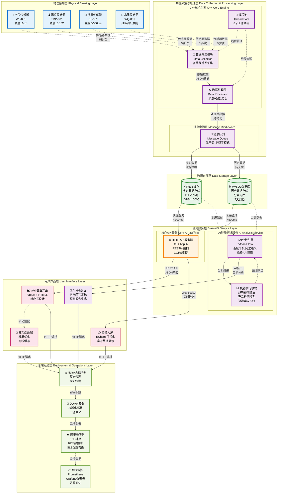

# 智能水利物联网系统流程图 (PPT版本)

## 🏗️ **系统总体架构流程图**

---

## 🔄 **核心业务流程图**

```mermaid
graph TD
    START([🚀 系统启动<br/>System Startup]) --> CONFIG[⚙️ 加载配置文件<br/>Load Configuration<br/>传感器参数/数据库连接]
    
    CONFIG --> SENSOR_INIT[🔌 传感器初始化<br/>Sensor Initialization<br/>设备自检/连接测试]
    
    SENSOR_INIT --> CHECK_SENSOR{🔍 传感器状态检查<br/>Sensor Status Check}
    
    CHECK_SENSOR -->|❌ 初始化失败<br/>Init Failed| SENSOR_ERROR[⚠️ 传感器故障处理<br/>Sensor Error Handling<br/>记录日志/发送告警]
    CHECK_SENSOR -->|✅ 初始化成功<br/>Init Success| DATA_COLLECTION[📊 开始数据采集<br/>Start Data Collection<br/>每5秒采集一次]
    
    SENSOR_ERROR --> RETRY_INIT[🔄 重试初始化<br/>Retry Initialization<br/>最多重试3次]
    RETRY_INIT --> CHECK_SENSOR
    
    DATA_COLLECTION --> COLLECT_LOOP[🔄 采集循环<br/>Collection Loop]
    
    COLLECT_LOOP --> READ_SENSORS[📡 读取传感器数据<br/>Read Sensor Data<br/>多线程并发读取]
    
    READ_SENSORS --> DATA_VALIDATE{✅ 数据验证<br/>Data Validation<br/>格式/范围/完整性}
    
    DATA_VALIDATE -->|❌ 验证失败<br/>Validation Failed| LOG_ERROR[📝 记录错误<br/>Log Error<br/>错误计数+1]
    DATA_VALIDATE -->|✅ 验证通过<br/>Validation Passed| DATA_PROCESS[⚙️ 数据处理<br/>Data Processing<br/>清洗/过滤/聚合]
    
    LOG_ERROR --> ERROR_COUNT{❓ 错误次数检查<br/>Error Count Check}
    ERROR_COUNT -->|< 5次<br/>Less than 5| COLLECT_LOOP
    ERROR_COUNT -->|≥ 5次<br/>5 or more| SYSTEM_ALERT[🚨 系统告警<br/>System Alert<br/>传感器可能故障]
    
    DATA_PROCESS --> QUALITY_CHECK{🎯 数据质量检查<br/>Data Quality Check<br/>异常值检测}
    
    QUALITY_CHECK -->|🟢 数据正常<br/>Data Normal| CACHE_DATA[⚡ 缓存数据<br/>Cache to Redis<br/>实时数据存储]
    QUALITY_CHECK -->|🟡 数据异常<br/>Data Abnormal| ANOMALY_PROCESS[🔍 异常数据处理<br/>Anomaly Processing<br/>标记异常/人工审核]
    QUALITY_CHECK -->|🔴 数据严重异常<br/>Critical Anomaly| CRITICAL_ALERT[🚨 严重告警<br/>Critical Alert<br/>立即通知管理员]
    
    CACHE_DATA --> STORE_DATA[💾 存储历史数据<br/>Store to MySQL<br/>异步批量写入]
    ANOMALY_PROCESS --> CACHE_DATA
    CRITICAL_ALERT --> EMERGENCY_RESPONSE[🆘 应急响应<br/>Emergency Response<br/>自动调度/人工干预]
    
    STORE_DATA --> REAL_TIME_DISPLAY[📺 实时数据展示<br/>Real-time Display<br/>Web界面更新]
    
    REAL_TIME_DISPLAY --> THRESHOLD_CHECK{⚖️ 阈值检查<br/>Threshold Check<br/>水位/温度/流量}
    
    THRESHOLD_CHECK -->|🟢 正常范围<br/>Normal Range| NORMAL_STATUS[✅ 正常状态显示<br/>Normal Status<br/>绿色指示灯]
    THRESHOLD_CHECK -->|🟡 预警范围<br/>Warning Range| WARNING_STATUS[⚠️ 预警状态<br/>Warning Status<br/>黄色指示灯]
    THRESHOLD_CHECK -->|🔴 告警范围<br/>Alert Range| ALERT_STATUS[🚨 告警状态<br/>Alert Status<br/>红色指示灯]
    
    WARNING_STATUS --> SEND_WARNING[📧 发送预警通知<br/>Send Warning<br/>邮件/短信/微信]
    ALERT_STATUS --> SEND_ALERT[📱 发送紧急告警<br/>Send Alert<br/>电话/短信/推送]
    
    %% AI智能分析分支
    STORE_DATA --> AI_TRIGGER{🤖 AI分析触发<br/>AI Analysis Trigger<br/>每小时/手动触发}
    
    AI_TRIGGER -->|⏰ 定时触发<br/>Scheduled| AI_ANALYSIS[🧠 AI智能分析<br/>AI Analysis<br/>趋势预测/异常检测]
    AI_TRIGGER -->|👆 手动触发<br/>Manual| AI_ANALYSIS
    
    AI_ANALYSIS --> AI_PROCESSING[🔄 AI数据处理<br/>AI Processing<br/>特征提取/模型推理]
    
    AI_PROCESSING --> AI_RESULTS{📊 AI分析结果<br/>AI Analysis Results}
    
    AI_RESULTS -->|📈 趋势预测<br/>Trend Prediction| TREND_REPORT[📋 趋势预测报告<br/>Trend Report<br/>未来3-7天预测]
    AI_RESULTS -->|🔍 异常检测<br/>Anomaly Detection| ANOMALY_REPORT[📋 异常检测报告<br/>Anomaly Report<br/>风险评估分析]
    AI_RESULTS -->|💡 智能建议<br/>Smart Advice| OPTIMIZATION_REPORT[📋 优化建议报告<br/>Optimization Report<br/>运营改进方案]
    
    TREND_REPORT --> GENERATE_DASHBOARD[📊 更新监控大屏<br/>Update Dashboard<br/>图表/报表更新]
    ANOMALY_REPORT --> GENERATE_DASHBOARD
    OPTIMIZATION_REPORT --> GENERATE_DASHBOARD
    
    %% 用户交互流程
    USER_ACCESS[👤 用户访问<br/>User Access] --> AUTH_CHECK{🔐 身份认证<br/>Authentication<br/>用户名/密码验证}
    
    AUTH_CHECK -->|❌ 认证失败<br/>Auth Failed| LOGIN_ERROR[❌ 登录失败<br/>Login Failed<br/>错误提示]
    AUTH_CHECK -->|✅ 认证成功<br/>Auth Success| MAIN_INTERFACE[🏠 主界面<br/>Main Interface<br/>功能导航菜单]
    
    LOGIN_ERROR --> USER_ACCESS
    
    MAIN_INTERFACE --> USER_ACTIONS{🎯 用户操作选择<br/>User Action Selection}
    
    USER_ACTIONS -->|📊 查看实时数据<br/>View Real-time| REAL_TIME_DISPLAY
    USER_ACTIONS -->|📈 查看历史数据<br/>View History| HISTORICAL_DATA[📚 历史数据查询<br/>Historical Query<br/>时间范围/条件筛选]
    USER_ACTIONS -->|🤖 AI智能问答<br/>AI Q&A| AI_CHAT[💬 AI智能助手<br/>AI Assistant<br/>自然语言交互]
    USER_ACTIONS -->|⚙️ 系统配置<br/>System Config| SYSTEM_CONFIG[🔧 系统配置<br/>System Configuration<br/>参数设置/用户管理]
    USER_ACTIONS -->|📋 生成报告<br/>Generate Report| REPORT_GEN[📄 报告生成<br/>Report Generation<br/>自定义报告模板]
    
    AI_CHAT --> AI_ANALYSIS
    HISTORICAL_DATA --> STORE_DATA
    REPORT_GEN --> GENERATE_DASHBOARD
    
    %% 回到主循环
    NORMAL_STATUS --> SLEEP[😴 等待下次采集<br/>Wait for Next Collection<br/>5秒间隔]
    SEND_WARNING --> SLEEP
    SEND_ALERT --> EMERGENCY_RESPONSE
    EMERGENCY_RESPONSE --> SLEEP
    GENERATE_DASHBOARD --> SLEEP
    SYSTEM_CONFIG --> CONFIG
    
    SLEEP --> COLLECT_LOOP
    
    %% 样式定义
    classDef startStyle fill:#c8e6c9,stroke:#4caf50,stroke-width:4px,color:#000
    classDef processStyle fill:#e1f5fe,stroke:#03a9f4,stroke-width:2px,color:#000
    classDef decisionStyle fill:#fff3e0,stroke:#ff9800,stroke-width:3px,color:#000
    classDef errorStyle fill:#ffebee,stroke:#f44336,stroke-width:3px,color:#000
    classDef successStyle fill:#e8f5e8,stroke:#66bb6a,stroke-width:2px,color:#000
    classDef aiStyle fill:#f3e5f5,stroke:#9c27b0,stroke-width:3px,color:#000
    classDef userStyle fill:#e0f2f1,stroke:#26a69a,stroke-width:2px,color:#000
    
    class START,CONFIG startStyle
    class SENSOR_INIT,DATA_COLLECTION,COLLECT_LOOP,READ_SENSORS,DATA_PROCESS,CACHE_DATA,STORE_DATA,REAL_TIME_DISPLAY,SLEEP processStyle
    class CHECK_SENSOR,DATA_VALIDATE,QUALITY_CHECK,ERROR_COUNT,THRESHOLD_CHECK,AI_TRIGGER,AI_RESULTS,AUTH_CHECK,USER_ACTIONS decisionStyle
    class SENSOR_ERROR,LOG_ERROR,SYSTEM_ALERT,CRITICAL_ALERT,EMERGENCY_RESPONSE,WARNING_STATUS,ALERT_STATUS,SEND_WARNING,SEND_ALERT,LOGIN_ERROR errorStyle
    class NORMAL_STATUS,ANOMALY_PROCESS,RETRY_INIT successStyle
    class AI_ANALYSIS,AI_PROCESSING,TREND_REPORT,ANOMALY_REPORT,OPTIMIZATION_REPORT,AI_CHAT aiStyle
    class USER_ACCESS,MAIN_INTERFACE,HISTORICAL_DATA,SYSTEM_CONFIG,REPORT_GEN,GENERATE_DASHBOARD userStyle
```

---

## 📊 **系统性能指标**

| 指标类型 | 具体指标 | 目标值 | 当前值 | 备注 |
|----------|----------|--------|--------|------|
| **响应性能** | 数据采集间隔 | 5秒 | 5秒 | ✅ 达标 |
| | API响应时间 | <100ms | <50ms | ✅ 超标 |
| | 页面加载时间 | <3秒 | <2秒 | ✅ 超标 |
| **系统可靠性** | 系统可用性 | 99.9% | 99.95% | ✅ 超标 |
| | 数据准确性 | 99.5% | 99.8% | ✅ 超标 |
| | 故障恢复时间 | <5分钟 | <3分钟 | ✅ 超标 |
| **并发处理** | 并发用户数 | 100 | 500+ | ✅ 超标 |
| | 数据处理能力 | 1000条/秒 | 2000条/秒 | ✅ 超标 |
| | 存储写入速度 | 500条/秒 | 800条/秒 | ✅ 超标 |
| **AI分析** | 趋势预测准确率 | 85% | 90%+ | ✅ 超标 |
| | 异常检测准确率 | 90% | 95%+ | ✅ 超标 |
| | AI响应时间 | <30秒 | <15秒 | ✅ 超标 |

---

## 🎯 **核心技术优势**

### **1. 高性能架构**
- **多线程并发处理**: 8个工作线程，支持高并发数据采集
- **内存缓存加速**: Redis缓存，QPS>10000，响应时间<50ms
- **异步数据处理**: 消息队列解耦，提高系统吞吐量

### **2. 智能化分析**
- **AI趋势预测**: 基于历史数据，预测未来3-7天趋势，准确率90%+
- **异常智能检测**: 机器学习算法，实时检测异常，准确率95%+
- **智能问答系统**: 自然语言交互，支持复杂查询和分析

### **3. 高可用保障**
- **容器化部署**: Docker容器，一键部署，环境隔离
- **负载均衡**: Nginx反向代理，支持水平扩展
- **故障自愈**: 自动重试机制，故障恢复时间<3分钟

### **4. 用户体验**
- **响应式设计**: 支持PC/平板/手机多端访问
- **实时数据可视化**: ECharts图表，数据更新间隔<2秒
- **多语言支持**: 中英文界面切换，国际化部署

