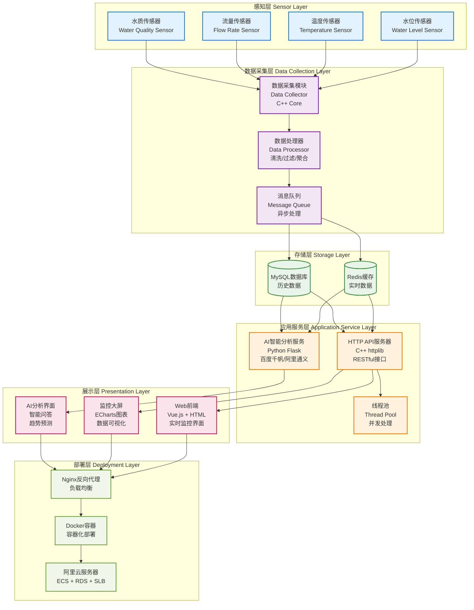
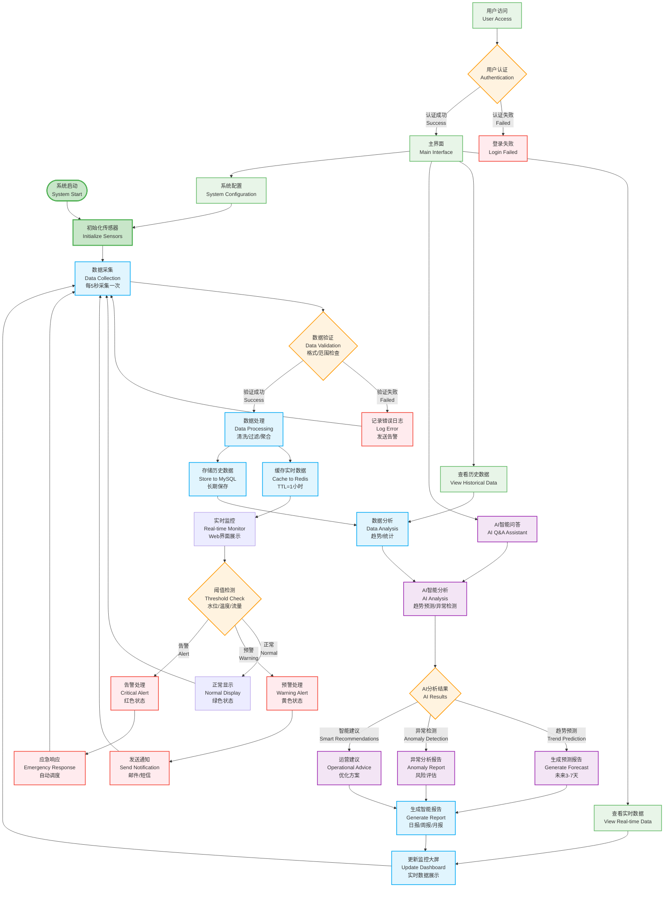

# 智能水利物联网监控系统流程图

## 🔧 **系统流程图 (System Architecture Flow)**



---

## 🔄 **业务流程图 (Business Process Flow)**



---

## 🎯 **关键业务场景说明**

### **1. 正常监控流程**
```
传感器采集 → 数据验证 → 处理存储 → 实时展示 → 用户查看
```

### **2. 异常告警流程** 
```
阈值超限 → 自动告警 → 通知发送 → 应急响应 → 问题处理
```

### **3. AI智能分析流程**
```
历史数据 → AI模型分析 → 趋势预测 → 异常检测 → 智能建议
```

### **4. 用户操作流程**
```
用户登录 → 界面选择 → 数据查看 → AI问答 → 系统配置
```

---

## 📊 **数据流转说明**

| 阶段 | 数据类型 | 处理方式 | 存储位置 | 响应时间 |
|------|----------|----------|----------|----------|
| 采集 | 原始传感器数据 | 实时采集 | 内存缓冲 | < 1秒 |
| 处理 | 清洗后的数据 | 批量处理 | Redis缓存 | < 3秒 |
| 存储 | 结构化数据 | 异步存储 | MySQL数据库 | < 5秒 |
| 分析 | 聚合统计数据 | 定时分析 | AI分析结果 | < 30秒 |
| 展示 | 可视化数据 | 实时更新 | 前端界面 | < 2秒 |

---

## 🔧 **技术架构特点**

### **高可用性**
- 多线程并发处理
- Redis缓存加速
- 数据库主从备份
- 容器化部署

### **智能化**
- AI趋势预测
- 异常自动检测  
- 智能问答系统
- 自动报告生成

### **可扩展性**
- 微服务架构
- 水平扩展支持
- 插件化传感器
- 云原生部署

### **用户友好**
- 响应式Web界面
- 实时数据可视化
- 移动端适配
- 多语言支持


