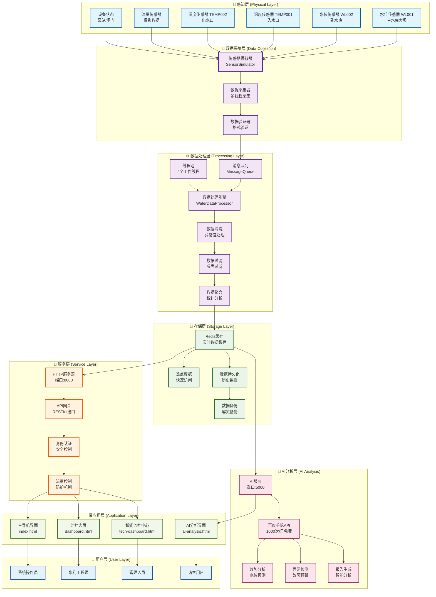

# 智能水利物联网系统 - 系统流程图

## 系统架构流程图

## 技术架构特点

### 🏗️ 分层架构设计
- **感知层**: 多种传感器数据采集
- **处理层**: 高性能C++数据处理引擎
- **存储层**: Redis缓存 + 数据持久化
- **服务层**: RESTful API接口
- **AI层**: 智能分析与预测
- **应用层**: 专业监控界面

### ⚡ 性能优化
- **并发处理**: 4个工作线程并行处理
- **缓存机制**: Redis热点数据缓存
- **异步处理**: 消息队列解耦
- **负载均衡**: 多传感器负载分散

### 🔒 安全可靠
- **数据验证**: 多层数据校验
- **异常处理**: 完善的错误处理机制
- **容灾备份**: 数据持久化和备份
- **访问控制**: API安全认证

### 🤖 智能特性
- **免费AI**: 百度千帆1000次/日免费额度
- **趋势预测**: 水位变化趋势分析
- **异常检测**: 设备故障预警
- **智能报告**: 自动生成分析报告
